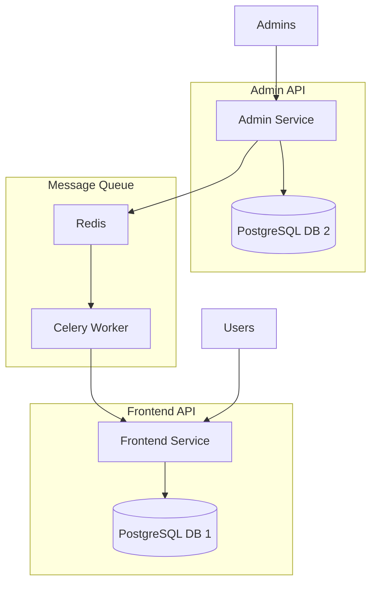

# Library Management System

A microservices-based library management system built with Django REST Framework, featuring separate Frontend and Admin APIs with inter-service communication.

## Table of Contents

- [Overview](#overview)
- [Architecture](#architecture)
- [Features](#features)
- [Tech Stack](#tech-stack)
- [Prerequisites](#prerequisites)
- [Installation](#installation)
- [API Documentation](#api-documentation)
- [Testing](#testing)
- [Project Structure](#project-structure)
- [Environment Variables](#environment-variables)
- [Contributing](#contributing)
- [License](#license)

## Overview

This library management system consists of two independent Django REST API services:
- **Frontend API**: User-facing service for browsing and borrowing books
- **Admin API**: Administrative service for managing the book catalog and users

The services communicate asynchronously using Celery and Redis, ensuring data consistency while maintaining service independence.

## Architecture



## Features

### Frontend API
- **User Management**
  - User registration with email, first name, and last name
  - JWT-based authentication
  - View personal borrowed books
  
- **Book Browsing**
  - List all available books
  - Get single book details
  - Filter books by publisher (e.g., Wiley, Apress, Manning)
  - Filter books by category (e.g., fiction, technology, science)
  - Search books by title, author, or ISBN
  
- **Book Borrowing**
  - Borrow books with specified duration (1-30 days)
  - Automatic availability tracking
  - View return dates

### Admin API
- **Book Management**
  - Add new books to the catalog
  - Remove books from the catalog
  - Automatic sync with Frontend API
  
- **User Management**
  - List all enrolled library users
  - View users and their borrowed books
  
- **Inventory Tracking**
  - List unavailable books with expected return dates
  - Track borrowing history

## Tech Stack

- **Backend Framework**: Django 4.2.7, Django REST Framework 3.14.0
- **Authentication**: JWT (djangorestframework-simplejwt)
- **Databases**: PostgreSQL (separate instances for each service)
- **Message Queue**: Redis 7
- **Task Queue**: Celery 5.3.4
- **API Documentation**: REST Framework built-in
- **Containerization**: Docker & Docker Compose
- **Web Server**: Gunicorn
- **Testing**: pytest, pytest-django

## Prerequisites

- Docker Desktop (includes Docker and Docker Compose)
- Git
- Python 3.11+ (for local development)
- Postman or curl (for API testing)

## Installation

### 1. Clone the Repository

```bash
git clone https://github.com/yourusername/library-management-system.git
cd library-management-system
```

### 2. Set Up Environment Variables

Create a `.env` file in the root directory:

```bash
cp .env.example .env
```

Edit `.env` and set secure values:

```env
# Security Keys - Generate secure random keys!
FRONTEND_SECRET_KEY=your-secure-frontend-key-here
ADMIN_SECRET_KEY=your-secure-admin-key-here
INTER_SERVICE_TOKEN=your-secure-inter-service-token

# Debug (set to False in production)
DEBUG=True

# Allowed Hosts
ALLOWED_HOSTS=localhost,127.0.0.1
```

### 3. Build and Run with Docker Compose

```bash
# Build all services
docker-compose build

# Start all services in detached mode
docker-compose up -d

# Check service status
docker-compose ps
```

### 4. Run Database Migrations

```bash
# Frontend API migrations
docker-compose exec frontend-api python manage.py makemigrations
docker-compose exec frontend-api python manage.py migrate

# Admin API migrations
docker-compose exec admin-api python manage.py makemigrations
docker-compose exec admin-api python manage.py migrate
```

### 5. Create Admin Superuser

```bash
docker-compose exec admin-api python manage.py createsuperuser
```

### 6. Load Sample Data (Optional)

```bash
# Create sample publishers and categories
docker-compose exec frontend-api python manage.py shell << EOF
from books.models import Publisher, Category
Publisher.objects.create(name="Wiley")
Publisher.objects.create(name="Apress")
Publisher.objects.create(name="Manning")
Category.objects.create(name="Fiction")
Category.objects.create(name="Technology")
Category.objects.create(name="Science")
EOF
```

### 7. Access the Services

- Frontend API: http://localhost:8000
- Admin API: http://localhost:8001
- Frontend API Docs: http://localhost:8000/api/
- Admin API Docs: http://localhost:8001/api/

## API Documentation

### Frontend API Endpoints

#### Authentication
```http
POST /api/users/register/
Content-Type: application/json

{
  "email": "user@example.com",
  "first_name": "John",
  "last_name": "Doe",
  "password": "securepassword",
  "password_confirm": "securepassword"
}
```

```http
POST /api/token/
Content-Type: application/json

{
  "username": "user@example.com",
  "password": "securepassword"
}
```

#### Books
```http
# List available books
GET /api/books/
Authorization: Bearer <token>

# Filter books
GET /api/books/?publisher_name=Wiley
GET /api/books/?category_name=Technology
GET /api/books/?search=python

# Get single book
GET /api/books/{id}/
Authorization: Bearer <token>

# Borrow a book
POST /api/books/borrow/
Authorization: Bearer <token>
Content-Type: application/json

{
  "book_id": 1,
  "days": 7
}

# View my borrowed books
GET /api/books/my-borrowed/
Authorization: Bearer <token>
```

### Admin API Endpoints

#### Authentication
```http
POST /api/token/
Content-Type: application/json

{
  "username": "admin",
  "password": "adminpassword"
}
```

#### Book Management
```http
# Add new book
POST /api/admin/books/
Authorization: Bearer <token>
Content-Type: application/json

{
  "title": "Clean Code",
  "author": "Robert C. Martin",
  "isbn": "9780132350884",
  "publisher": 1,
  "category": 2,
  "published_date": "2008-08-01",
  "description": "A Handbook of Agile Software Craftsmanship"
}

# Delete book
DELETE /api/admin/books/{id}/
Authorization: Bearer <token>
```

#### User Management
```http
# List all library users
GET /api/admin/users/
Authorization: Bearer <token>

# List borrowed books with user info
GET /api/admin/borrowed-books/
Authorization: Bearer <token>

# List unavailable books
GET /api/admin/unavailable-books/
Authorization: Bearer <token>
```

## Testing

### Run All Tests

```bash
# Frontend API tests
docker-compose exec frontend-api python manage.py test

# Admin API tests
docker-compose exec admin-api python manage.py test
```

### Run Specific Tests

```bash
# Test specific app
docker-compose exec frontend-api python manage.py test books

# Test specific test case
docker-compose exec admin-api python manage.py test books.tests.AdminBookAPITestCase
```

### Run with Coverage

```bash
# Install coverage in container
docker-compose exec frontend-api pip install coverage

# Run with coverage
docker-compose exec frontend-api coverage run --source='.' manage.py test
docker-compose exec frontend-api coverage report
docker-compose exec frontend-api coverage html
```

## Project Structure

```
library-management-system/
├── frontend-api/
│   ├── Dockerfile
│   ├── requirements.txt
│   ├── manage.py
│   ├── frontend_api/
│   │   ├── __init__.py
│   │   ├── settings.py
│   │   ├── urls.py
│   │   ├── wsgi.py
│   │   └── celery.py
│   ├── books/
│   │   ├── models.py
│   │   ├── serializers.py
│   │   ├── views.py
│   │   ├── urls.py
│   │   ├── authentication.py
│   │   └── tests.py
│   └── users/
│       ├── models.py
│       ├── serializers.py
│       ├── views.py
│       ├── urls.py
│       └── tests.py
├── admin-api/
│   ├── Dockerfile
│   ├── requirements.txt
│   ├── manage.py
│   ├── admin_api/
│   │   ├── __init__.py
│   │   ├── settings.py
│   │   ├── urls.py
│   │   ├── wsgi.py
│   │   └── celery.py
│   ├── books/
│   │   ├── models.py
│   │   ├── serializers.py
│   │   ├── views.py
│   │   ├── urls.py
│   │   ├── tasks.py
│   │   └── tests.py
│   └── users/
│       └── models.py
├── docker-compose.yml
├── .env
├── .env.example
└── README.md
```

## Environment Variables

| Variable | Description | Example |
|----------|-------------|---------|
| `FRONTEND_SECRET_KEY` | Django secret key for Frontend API | `your-secret-key-here` |
| `ADMIN_SECRET_KEY` | Django secret key for Admin API | `your-secret-key-here` |
| `INTER_SERVICE_TOKEN` | Token for inter-service authentication | `your-secure-token` |
| `DEBUG` | Django debug mode | `True` or `False` |
| `ALLOWED_HOSTS` | Comma-separated list of allowed hosts | `localhost,127.0.0.1` |

## Development

### Local Development Setup

If you want to run the services locally without Docker:

1. **Frontend API Setup**
```bash
cd frontend-api
python -m venv venv
source venv/bin/activate  # Windows: venv\Scripts\activate
pip install -r requirements.txt
python manage.py migrate
python manage.py runserver 8000
```

2. **Admin API Setup**
```bash
cd admin-api
python -m venv venv
source venv/bin/activate  # Windows: venv\Scripts\activate
pip install -r requirements.txt
python manage.py migrate
python manage.py runserver 8001
```

3. **Start Redis**
```bash
docker run -d -p 6379:6379 redis:7-alpine
```

4. **Start Celery Worker**
```bash
cd admin-api
celery -A admin_api worker -l info
```

### Code Style

This project follows PEP 8 style guidelines. To check code style:

```bash
# Install flake8
pip install flake8

# Run style check
flake8 frontend-api/ admin-api/
```

### Database Schema

#### Frontend API Models
- **LibraryUser**: Custom user model with email authentication
- **Publisher**: Book publishers (Wiley, Apress, etc.)
- **Category**: Book categories (Fiction, Technology, etc.)
- **Book**: Book catalog with availability tracking
- **BorrowedBook**: Borrowing records with return dates

#### Admin API Models
- **Book**: Mirror of Frontend book catalog
- **LibraryUser**: Synced user information
- **BorrowedBook**: Borrowing records for reporting

## Troubleshooting

### Common Issues

1. **Services won't start**
   ```bash
   # Check logs
   docker-compose logs -f [service-name]
   
   # Rebuild images
   docker-compose build --no-cache
   ```

2. **Database connection errors**
   ```bash
   # Ensure databases are ready
   docker-compose ps
   
   # Restart services
   docker-compose restart
   ```

3. **Migration errors**
   ```bash
   # Reset migrations
   docker-compose exec [service] python manage.py migrate --fake-initial
   ```

4. **Celery not processing tasks**
   ```bash
   # Check Celery logs
   docker-compose logs -f celery-worker
   
   # Restart Celery
   docker-compose restart celery-worker
   ```

### Debug Mode

To enable detailed error messages:

1. Set `DEBUG=True` in `.env`
2. Restart services: `docker-compose restart`

## Contributing

1. Fork the repository
2. Create your feature branch (`git checkout -b feature/AmazingFeature`)
3. Commit your changes (`git commit -m 'Add some AmazingFeature'`)
4. Push to the branch (`git push origin feature/AmazingFeature`)
5. Open a Pull Request

### Contribution Guidelines

- Follow PEP 8 style guide
- Write tests for new features
- Update documentation as needed
- Ensure all tests pass before submitting PR

## License

This project is licensed under the MIT License - see the [LICENSE](LICENSE) file for details.

## Acknowledgments

- Django REST Framework for the excellent API framework
- Docker for containerization
- PostgreSQL for reliable data storage
- Redis and Celery for async task processing

Project Link: [https://github.com/Odion-Sonny/library-management-system](https://github.com/Odion-Sonny/library-management-system)